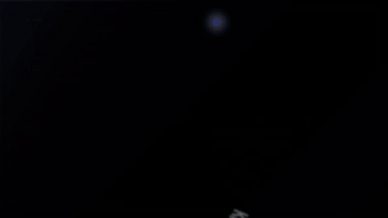

<p align="center"><a href="README.md">한국어</a> | English | <a href="README-ja.md">日本語</a></p>

<p align="center"></p>

<p align="center"><strong>ReelForge is a keyless AI video system that turns a one-line brief into a cinematic motion-graphic film.</strong></p>

The GIF above is not a mockup — it is the official 22.9-second showcase produced by the
v7 pipeline itself. Slide grammar (cards, panels, bullets) is banned at the system level;
a gallery of render-verified choreography supplies the typography, camera, data, and
transition direction.

## [loop] Core loop (v7 — Gallery-First)

```
one-line brief
  → D1 Concept     direction before copy: dominant object, world metaphor, one named visual event per scene
  → D2 Arc         intensity 0–100 curve + arc presets (ramp/double-peak/cliff/steady-pulse) + beat grid
  → D3 Routing     every scene gets its choreography from the gallery decision table — no blank-canvas authoring
  → D4 Copy        copy is laid on top of frozen direction (slot budgets enforced)
  → D5 Freeze      the direction-lint gate (RF-DIR-001..008) must pass before authoring starts
  → Scene swarm    workers only transform verified fragments under a keep/mutate contract
  → Pilot Gate     the engine refuses full compilation until one peak scene passes a solo render
  → Render + QC    deterministic render → full 1fps strip machine checks + viewer review → re-author failures only
  → Reharvest      new choreography that survives QC is stamped into the gallery (flywheel)
```

Core principle: **what is not verified is not vocabulary.** Every gallery entry has passed
real renders across 3 presets (blank / frozen-motion / low-contrast checks).

## [showcase] Official showcase

The full version of the hero GIF lives at [`demos/v7-showcase`](demos/v7-showcase) —
12 scenes in 22.9 seconds on a 160 bpm beat grid, running 13 gallery techniques:
letter-storm convergence → stripe reveal → strike-through draw-on → stepped counter rush →
overshoot slam → multiplane dolly → camera diving through a letter (zoom portal) →
glitch "click" swap → 3-depth parallax → checkmark seal.

Every frame obeys the project's design-rule document
([`demos/v7-showcase/direction/DESIGN-RULES.md`](demos/v7-showcase/direction/DESIGN-RULES.md)):
a 3-tier type scale, a total ban on boxes/cards/panels, no data-viz widgets
(the screen itself is the graph), exactly one accent locus per scene, and the success
color appearing exactly once — at the final seal.

## [quick-start] Quick Start

Agent path (recommended): open this repo in Claude Code, register
`skills/reelforge/SKILL.md` as a skill, then ask for something like
"make a 30-second brand intro with ReelForge". The skill drives the whole loop above,
from D1 concept to strip QC and reharvest.

Local smoke test:

```bash
cd <repo>
npm ci
./node_modules/.bin/hyperframes doctor

PROJECT_DIR="tmp/smoke-$(date +%Y%m%d-%H%M%S)"
mkdir -p "$PROJECT_DIR"
cp fixtures/golden-specs/minimal-3scene/scene_specs.json "$PROJECT_DIR/scene_specs.json"

node bin/vf pipeline run "$PROJECT_DIR" --profile mock
node bin/vf studio "$PROJECT_DIR" --port 4317
```

## [gallery] The choreography gallery — the heart of the system

[`skills/reelforge/references/gallery/`](skills/reelforge/references/gallery/) holds
**31 render-verified choreography entries**
(typo 9 · camera 4 · data 3 · object 4 · atmo 2 · seal 2 · transition pairs 4).

- Vocabulary: [`references/grammar/`](skills/reelforge/references/grammar/00-INDEX.md) —
  101 AE-style motion techniques across 8 domains, translated to a GSAP-core contract
- Grammar of choice: [`gallery/ROUTING.md`](skills/reelforge/references/gallery/ROUTING.md) —
  a scene-intent × intensity × mood decision table
- Verified reality: `gallery/fragments/` + `gallery-index.json` — intake only through
  `scripts/gallery-verify.mjs` (3-preset real renders → stamp)
- Gate: `scripts/direction-lint.mjs` — blocks unknown vocabulary, enforces intensity
  bands, slot budgets, arc consistency, and transition-pair adjacency. Sketch authoring
  is allowed but loudly marked "sketch-authored"

## [rules] Quality is legislated

Scene workers are not trusted to have taste. Each project freezes a design-rule document
(type scale, grid, color, box/data-viz bans, beat grid, handoffs) and the full text is
embedded into every worker prompt. After rendering, the full 1fps strip is judged twice —
machine checks (blank / low-contrast / frozen motion) and viewer review — and only
failing scenes are re-dispatched with reasons (max 2 rounds per scene). Rendering is
seek-based and deterministic: same input, same pixels; render-lint rejects
Math.random, Date.now, and fetch.

## [demos] Demos

| Demo | What it is |
|---|---|
| [v7-showcase](demos/v7-showcase) | **Official showcase** — 12-scene maximal cut, source of the hero GIF |
| [pilot-usage-v7](demos/pilot-usage-v7) | A/B pilot — same copy & timing, direction swapped; 3:0 unanimous judge win |
| [docs/baseline](docs/baseline) | before/after 1fps strip evidence (old slide-style vs v7) |

The d1–d3 demos in the v0.1.0 release are legacy-pipeline output, kept as history.

## [reference] Reference

CLI and configuration: [docs/usage.md](docs/usage.md) · Studio: [docs/studio.md](docs/studio.md) ·
pipeline resume: [docs/pipeline.md](docs/pipeline.md) · compiler contract:
[docs/compiler.md](docs/compiler.md) · preset catalog: [docs/design-presets.md](docs/design-presets.md) ·
gallery operations: [GALLERY.md](skills/reelforge/references/gallery/GALLERY.md).

## [license-disclaimer] License & disclaimer

Code is Apache-2.0. Fonts, music, images, and TTS output follow their own licenses and
terms; check per-project provenance before public distribution or commercial use.
The showcase BGM is produced by our own keyless generation pipeline.
